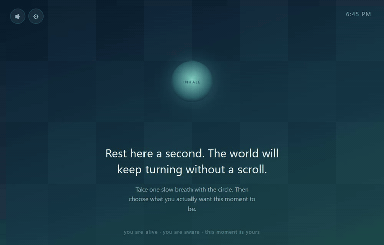
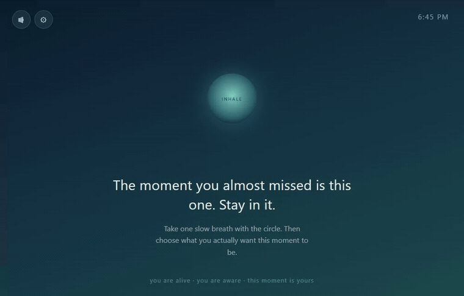

<h1 align="center">Inner Peace 🫛</h1>

<em>Redirect distracting sites to a calm breathing space — a moment of inner peas.</em>

  

Open a site you've chosen to block, and Inner Peace gently intercepts it — a slow
breathing circle, one reminder to be here, and optional nature sound instead of a feed.

  

Add or remove any site right from the calm page. Instagram is blocked by default.

  

## Install

No build step. In `chrome://extensions` (or `edge://extensions`), turn on
**Developer mode**, click **Load unpacked**, and select this folder.

## More

Usage, settings, development, and licensing live in **[AGENTS.md](AGENTS.md)**.
Code is MIT ([LICENSE](LICENSE)); bundled sounds keep their own licenses ([CREDITS.txt](CREDITS.txt)).
